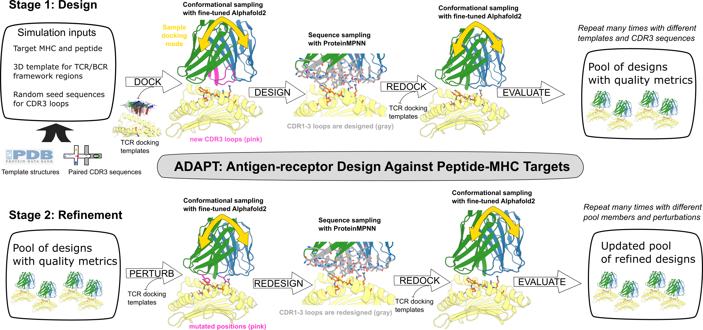

# ADAPT

## Antigen-receptor Design Against Peptide-MHC Targets

This repository contains Python code implementing the ADAPT antigen-receptor design
pipeline. This pipeline is described in the bioRxiv preprint

"Targeting peptide–major histocompatibility complexes with designed T cell receptors and antibodies"

Amir Motmaen, Kevin M. Jude, Nan Wang, Anastasia Minervina, Kirsten Thompson, David Feldman, Mauriz A. Lichtenstein, Abishai Ebenezer, Colin Correnti, Paul G. Thomas, K. Christopher Garcia*, David Baker*, Philip Bradley* [*- corresponding authors]


[insert link]

## here's the abstract
Class I major histocompatibility complexes (MHCs), expressed on the surface of all nucleated cells, present peptides derived from intracellular proteins for surveillance by T cells.
The precise recognition of foreign or mutated peptide–MHC (pMHC) complexes by T cell receptors (TCRs) is fundamental to immune defense against pathogens and tumors.
Although patient-derived TCRs specific for cancer-associated antigens have been used to engineer tumor-targeting therapies, their reactivity toward self- or near-self antigens may be constrained by negative selection in the thymus.
Here, we introduce a structure-based deep learning framework, ADAPT (Antigen-receptor Design Against Peptide-MHC Targets), for the design of TCRs and antibodies that bind to pMHC targets of interest.
We validated the ADAPT pipeline by designing and characterizing TCRs and antibodies against a diverse panel of pMHCs.
Cryogenic electron microscopy structures of two designed antibodies bound to their respective pMHC targets demonstrate atomic-level accuracy at the recognition interface, supporting the robustness of our structure-based approach.
Computationally designed TCRs and antibodies targeting pMHC complexes could enable a broad range of therapeutic applications, from cancer immunotherapy to autoimmune disease treatment, while insights gained from TCR–pMHC design may advance predictive understanding of TCR specificity with implications for basic immunology and clinical diagnostics.



# Installation

## the pipeline scripts

The ADAPT pipeline consists of a set of scripts that call the independent
neural network tools Alphafold2, ProteinMPNN, and (optionally for design
ranking) RFantibody. To run the scripts, you will need to create a Python environment
which satisfies the requirements in `requirements.txt`. We recommend that you
do this in a virtual environment. With the environment activated you could do
something like

```
cd ADAPT/
pip install -r requirements.txt
```

## the NN models

We are working on a Docker file to make this process easier, but in the meantime
it will be necessary for you to have working installations of those 3
packages, which are available at the following locations:

https://github.com/google-deepmind/alphafold

https://github.com/dauparas/ProteinMPNN

https://github.com/RosettaCommons/RFantibody

Note that ADAPT ships with a slightly modifed version of Alphafold2, but you will
still need a compatible Python environment to run it. The installation process is
somewhat platform specific as it depends on your version of CUDA.


## telling ADAPT where to find things

Once you have the network tools installed and the parameter and database files
downloaded, you will need to edit `./config_paths.json` to point the ADAPT scripts
to the various files and environments.

# running TCR design

A typical workflow could consist of running many independent design simulations,
each with a different `--outfile_prefix`, with commands like

```
python design/dock_design.py \
    --pmhc_targets design_targets.tsv \
    --tcr_pdbids 1oga 5bs0 3gsn 3qdg \
    --design_cdrs 0 1 3 4 5 7 \
    --num_designs 10 \
    --outfile_prefix /path/to/output/run1_design_jobN
```

where `jobN` would vary across the different jobs, and `design_targets.tsv` specifies the pMHC targets and would look something like this:

```
organism	mhc_class	mhc	peptide
human	1	A*01:01	EVDPIGHLY
human	1	A*02:01	ALYDKTKRI
human	1	A*02:01	TLMSAMTNL
```


# running TCR refinement

After making several thousand initial designs, the output TSV files from those runs
could be merged, ranked by model quality, and reduced to a subset of 100-200
designs that form the starting pool for refinement. The output rows corresponding to
those designs would be saved in a single file named something like
`run1_refine_pool.tsv` and passed to multiple independent refinement simulations
running commands like the following:


```

python design/dock_refine.py \
    --poolfile /path/to/output/run1_refine_pool.tsv \
    --sort_tag combo_score_wtd \
    --pmhc_targets design_targets.tsv \
    --max_pool_size 200 \
    --max_per_lineage 10 \
    --num_parents 10 \
    --num_mutations 2 \
    --outfile_prefix /path/to/output/run1_refine_jobN

```

Here the `--sort_tag` argument identifies the column of the pool file which should
be used for model quality ranking during refinement.

# running antibody design

```
python design/dock_design_ig.py \
    --pmhc_targets design_targets.tsv \
		--abids 7sg5HL 7yv1HL 8cheHL 7kqlHL 4hpyHL 8bg4Aa 6vboHL 6b5rHL 7sscHL \
    --design_cdrs 0 1 3 4 5 7 \
		--both_orientations \
    --num_designs 10 \
    --outfile_prefix /path/to/output/run2_design_jobN
```


# more details to come...